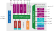

# Architecture

Cheshire is highly configurable; available features and resources depend on its parameterization. The above block diagram depicts a fully-featured Cheshire SoC, which currently provides:

- **Cores**:
    - Up to 31 Linux-capable CVA6 cores with self-invalidation-based coherence
    - A RISC-V debug module with JTAG transport

- **Peripherals**:
    - Various standard IO interfaces (UART, I2C, SPI, and GPIOs)
    - A boot ROM enabling boot from SD cards, SPI flash, or I2C EEPROM
    - A VGA display controller with built-in DMA
    - A fully-digital chip-to-chip or die-to-die serial link
    - A high-throughput system DMA

- **Interconnect**:
    - A last level cache (LLC) configurable as a scratchpad memory (SPM) per-way
    - Up to 16 external AXI4 manager ports and 16 AXI and Regbus subordinate ports
    - Per-manager AXI4 traffic regulators for real-time applications
    - Per-manager AXI4 bus error units (UNBENT) for interconnect error handling

- **Interrupts**:
    - Core-local (CLINT *and* CLIC) and platform (PLIC) interrupt controllers
    - Dynamic interrupt routing from and to internal and external targets.

## Memory Map

Cheshire's internal memory map is *static*. While device instantiation and layout may vary, each device is provided an address space of *fixed* location and size. For this, Cheshire *reserves* the address space from `0x0` to `0x2000_0000`, which is currently allocated as follows:

+--------------------+-------------------+---------------+------+-------+
| Block              | Device            | Start         | Size | Flags |
+====================+===================+===============+======+=======+
| 256K periphs @ AXI | Debug ROM         | `0x0000_0000` | 256K | E     |
+--------------------+-------------------+---------------+------+-------+
| 4K periphs @ AXI   | AXI DMA (Cfg)     | `0x0100_0000` | 4K   |       |
+--------------------+-------------------+---------------+------+-------+
| 256K periphs @ Reg | Boot ROM          | `0x0200_0000` | 256K | E     |
|                    +-------------------+---------------+------+-------+
|                    | CLINT             | `0x0204_0000` | 256K |       |
|                    +-------------------+---------------+------+-------+
|                    | IRQ router        | `0x0208_0000` | 256K |       |
|                    +-------------------+---------------+------+-------+
|                    | AXI RT (Cfg)      | `0x020C_0000` | 256K |       |
+--------------------+-------------------+---------------+------+-------+
| 4K periphs @ Reg   | SoC Regs          | `0x0300_0000` | 4K   |       |
|                    +-------------------+---------------+------+-------+
|                    | LLC (Cfg)         | `0x0300_1000` | 4K   |       |
|                    +-------------------+---------------+------+-------+
|                    | UART              | `0x0300_2000` | 4K   |       |
|                    +-------------------+---------------+------+-------+
|                    | I2C               | `0x0300_3000` | 4K   |       |
|                    +-------------------+---------------+------+-------+
|                    | SPI Host          | `0x0300_4000` | 4K   |       |
|                    +-------------------+---------------+------+-------+
|                    | GPIO              | `0x0300_5000` | 4K   |       |
|                    +-------------------+---------------+------+-------+
|                    | Serial Link (Cfg) | `0x0300_6000` | 4K   |       |
|                    +-------------------+---------------+------+-------+
|                    | VGA (Cfg)         | `0x0300_7000` | 4K   |       |
|                    +-------------------+---------------+------+-------+
|                    | UNBENT            | `0x0300_8000` | 4K   |       |
+--------------------+-------------------+---------------+------+-------+
| INTCs @ Reg        | PLIC              | `0x0400_0000` | 64M  |       |
|                    +-------------------+---------------+------+-------+
|                    | CLICs             | `0x0800_0000` | 64M  |       |
+--------------------+-------------------+---------------+------+-------+
| LLC SPM @ AXI      | cached            | `0x1000_0000` | 64M  | CIE   |
|                    +-------------------+---------------+------+-------+
|                    | uncached          | `0x1400_0000` | 64M  | IE    |
+--------------------+-------------------+---------------+------+-------+

The flags are defined as follows:

- **C***acheable*: Accessed data may be cached in the L1 or LLC caches
- **I***dempotent*: Multiple identical or composing accesses are equivalent to one access
- **E***xecutable*: Data in this region may be executed.

Additionally, Cheshire assumes the following parameterized layout for external resources:

| Block              | Start               | End               | Flags    |
| ------------------ | ------------------- | ----------------- | -------- |
| External on-chip   | `0x2000_0000`       | `0x8000_0000`     | (Param.) |
| LLC out (DRAM)     | `LlcOutRegionStart` | `LlcOutRegionEnd` | CIE      |
| Serial Link        | `SlinkRegionStart`  | `SlinkRegionEnd`  |          |

The *external on-chip* region is split into one subregion with full `CIE` flags and one without flags to minimize parameterization complexity. The `Cva6ExtCieOnTop` and `Cva6ExtCieLength` parameters control the order and partitioning of these two regions, respectively.

The *LLC out* region must not collide with any other regions and defaults on starting at the lowest available address, `0x8000_0000`. The *Serial Link* region defaults on starting at `0x1_0000_0000`, configuring the `SlinkTxAddrMask` and `SlinkTxAddrDomain` parameters to mirror the lower 32-bit space of another identical chip from this address base.

## Components and Parameters

Except for external hart debug info and interface types (see [Instantiating Cheshire](../tg/integr.md#instantiating-cheshire)), Cheshire is fully parameterized through its `Cfg` struct parameter. We will first describe global parameters, then discuss the functionality and parameterization of each component individually.

For defaults of any parameters, `cheshire_pkg::DefaultCfg` is the *single source of truth*. Note, however, that this does *not* mean `DefaultCfg` parameters are suitable for your system or usecase; please carefully consider and choose all parameters in your instantiation.

The following global parameters control basic functionality and features and can be read by software in the *SoC Registers*:

| Parameter     | Type / Range | Description                                        |
| ------------- | ------------ | -------------------------------------------------- |
| `RtcFreq`     | `word_bt`    | Frequency (Hz) configured for real-time clock      |
| `PlatformRom` | `word_bt`    | Address of platform ROM; see [Boot ROM](#boot-rom) |
| `Bootrom`     | `bit`        | Whether boot ROM is available                      |
| `Uart`        | `bit`        | Whether UART is available                          |
| `I2c`         | `bit`        | Whether I2C host is available                      |
| `SpiHost`     | `bit`        | Whether SPI is available                           |
| `Gpio`        | `bit`        | Whether GPIO is available                          |
| `Dma`         | `bit`        | Whether DMA is available                           |
| `SerialLink`  | `bit`        | Whether serial link is available                   |
| `Vga`         | `bit`        | Whether VGA is available                           |
| `AxiRt`       | `bit`        | Whether AXI RT is available                        |
| `Clic`        | `bit`        | Whether CLIC is available                          |
| `IrqRouter`   | `bit`        | Whether IRQ Router is available                    |
| `BusErr`      | `bit`        | Whether UNBENT (bus error unit) is available       |

### CVA6 Cores

Cheshire defaults on using CVA6 with hypervisor and CLIC support enabled; RV32 configurations are *not* supported. Most parameters for the CVA6 cores are derived from Cheshire's configuration or immutable. The available core parameters are listed below:

| Parameter                    | Type / Range | Description                                     |
| ---------------------------- | ------------ | ----------------------------------------------- |
| `NumCores`                   | `1..31`      | Number of instantiated CVA6 cores               |
| `Cva6RASDepth`               | `shrt_bt`    | Depth of CVA6 return address stack (RAS)        |
| `Cva6(BTB|BHT|NrPMP)Entries` | `shrt_bt`    | Number of BTB, BHT, and PMP entries in CVA6     |
| `Cva6ExtCieLength`           | `doub_bt`    | CIE subregion length in external on-chip region |
| `Cva6ExtCieOnTop`            | `bit`        | Whether CIE subregion is on top or bottom       |
| `CoreMaxTxns`                | `dw_bt`      | Maximum total AXI4 transactions per core        |
| `CoreMaxTxnsPerId`           | `dw_bt`      | Maximum total AXI4 transactions per core and ID |
| `CoreUserAmoOffs`            | `doub_bt`    | Base offset for core IDs within user AMO range  |

Each CVA6 core is a standalone AXI4 manager at the crossbar. Coherence is maintained through a self-invalidation scheme and RISC-V atomics are handled through a custom, user-channel-based AXI4 extension. For the latter, we wrap the cores and other managers to give each a default user channel assignment and, for atomics-capable managers, a unique ID on a slice of user bits.

### Interconnect

The interconnect is composed of a main [AXI4](https://github.com/pulp-platform/axi) crossbar with AXI5 atomic operations (ATOPs) support and an auxiliary [Regbus](https://github.com/pulp-platform/register_interface) demultiplexer providing access to numerous peripherals and configuration interfaces. The Regbus has a static data width of 32 bit.

As the Regbus protocol is not capable of bursts, parallel read and writes, or pipelining, it is much less performant than AXI4, but also much cheaper to implement. Thus, our approach of hierarchically combining AXI4 and Regbus significantly improves interconnect scaling.

The internal interconnect exposes the following parameters:

| Parameter                   | Type / Range | Description                                       |
| --------------------------- | ------------ | -----------------------------------------------   |
| `AddrWidth`                 | `32..64`     | AXI4 and Regbus address width                     |
| `Axi(Data|User|MstId)Width` | `shrt_bt`    | AXI4 data, user, and manager ID width             |
| `AxiMax(Mst|Slv)Trans`      | `shrt_bt`    | AXI4 maximum inflight transactions at crossbar    |
| `AxiUserDefault`            | `doub_bt`    | AXI4 default user value amended by user features  |
| `AxiUserAmo(Msb|Lsb)`       | `dw_bt`      | AXI4 user channel bit-range used by RISC-V AMOs   |
| `AxiUserErr(Bits|Lsb)`      | `dw_bt`      | AXI4 user channel bit-range for custom errors     |
| `RegMax(Read|Write)Txns`    | `dw_bt`      | Max. inflight transactions at Regbus AMO filter   |
| `RegAmoNumCuts`             | `aw_bt`      | Number of timing cuts inside Regbus AMO filter    |
| `RegAmoPostCut`             | `bit`        | Whether to insert a cut after Regbus AMO filter   |
| `RegAdaptMemCut`            | `bit`        | Whether to insert a cut inside AXI-to-Rb. adapter |
| `(Axi|Reg)ExtNum(Mst|Slv)`  | `0..15`      | AXI4 and Regbus number of external Mgrs. or Subs. |
| `(Axi|Reg)ExtNumRules`      | `0..15`      | AXI4 and Regbus number of external address rules  |
| `(Axi|Reg)ExtRegion*`       | `doub_bt`    | AXI4 and Regbus external address regions          |
| `AxiRtNumPending`           | `aw_bt`      | Number of outstanding transactions in RT units    |
| `AxiRtWBufferDepth`         | `dw_bt`      | The depth of the AXI-RT write buffer              |
| `AxiRtNumAddrRegions`       | `aw_bt`      | Number of address regions for every AXI manager   |
| `AxiRtCutPaths`             | `bit`        | Enable internal cuts in the RT units              |
| `AxiRtEnableChecks`         | `bit`        | Enable transaction checks within the RT units     |

Both the AXI4 and Regbus interconnects support exposing a limited number of external manager and subordinate ports; this is the intended mechanism through which Cheshire can be integrated with wrapping SoCs' memory systems.

The parameter `AxiUserDefault` defines the default AXI4 user signal assignment. `AxiUserAmo(Msb|Lsb)` and `AxiUserErr(Bits|Lsb)` define which bits of the user signals identify RISC-V atomics managers and communicate custom errors, respectively.

The AXI4 interconnect has two optional features. `AxiRt` adds traffic regulation units to each AXI4 manager to provide bandwidth and traffic control for real-time applications. `BusErr` adds the UNBENT bus error reporter to all managers spawning requests and imprecisely reports AXI4 error responses through a Regbus-mapped interface.

### Interrupts

Cheshire provides a flexible RISC-V interrupt architecture that can route and multiplex internal and external interrupts to both internal and external controllers and targets. For simplicity, the internal interrupt map is static (non-existent interrupts being tied to 0), while the external interrupt map depends on the surrounding system. Interrupts expose the following parameters:

| Parameter           | Type / Range | Description                                            |
| ------------------- | ------------ | ------------------------------------------------------ |
| `NumExtInIntrs`     | `doub_bt`    | Total number of external interrupt sources             |
| `NumExtClicIntrs`   | `shrt_bt`    | Number of external interrupt sources allocated in CLIC |
| `ClicIntCtlBits`    | `shrt_bt`    | Number of interrupt control bits in CLIC               |
| `NumExtOutIntrTgts` | `byte_bt`    | Number of external interrupt targets                   |
| `NumExtOutIntrs`    | `shrt_bt`    | Number of sources for external interrupt targets       |
| `NumExtIrqHarts`    | `doub_bt`    | Number of external interruptible harts                 |

First, all internal (`intr.intn`) and external (`intr_ext_i`) interrupt sources are collected (`intr`). From here, they either pass through an *interrupt router* if enabled (`IrqRouter`) or are simply fanned out to interrupt *targets*, which may support as many or fewer interrupt sources as provided by `intr`. If a target supports fewer sources, its interrupt sources are *truncated*.

Cheshire provides both a core-local interruptor (CLINT), grouping all per-core interrupts in one module, and a shared platform-level interrupt controller (PLIC). The former is used only for inter-processor and timer interrupts, while the latter is a proper interrupt target. If enabled (`Clic`), each CVA6 core also has a core-local interrupt controller (CLIC), another interrupt target. In addition to the PLIC and CLICs, any number external interrupt targets may be defined (`NumExtOutIntrTgts`) with their own number of incoming sources (`NumExtIrqHarts`).

Finally, the PLIC and grouped CLINT also support allocating external harts for which to manage interrupts (`NumExtIrqHarts`), i.e. harts without interrupt controllers of themselves.

### Debug Module

Cheshire provides a RISC-V-compliant [Debug Module](https://github.com/pulp-platform/riscv-dbg) with JTAG transport. It supports debugging both internal and external harts as well as system bus access (SBA). It exposes the following parameters:

| Parameter                 | Type / Range | Description                                      |
| ------------------------- | ------------ | ------------------------------------------------ |
| `DbgIdCode`               | `word_bt`    | JTAG ID code reported by Debug module            |
| `DbgMaxReqs`              | `dw_bt`      | Maximum outstanding requests to manager port     |
| `DbgMax(Read|Write)Txns`  | `dw_bt`      | Maximum ourstanding requests to subordinate port |
| `DbgAmoNumCuts`           | `aw_bt`      | Number of timing cuts inside Debug AMO filter    |
| `DbgAmoPostCut`           | `bit`        | Whether to insert a cut after Debug AMO filter   |

### Last Level Cache

The [Last Level Cache](https://github.com/pulp-platform/axi_llc) (LLC) sits between Cheshire and its main memory (usually DRAM). It is assumed to be the only manager accessing this memory and caches all accesses to it unless explicitly bypassed through AXI cache control signals. It exposes the following parameters:

| Parameter                  | Type / Range | Description                                       |
| -------------------------- | ------------ | ------------------------------------------------- |
| `LlcOutConnect`            | `bit`        | Whether to create a manager port for the LLC      |
| `LlcNotBypass`             | `bit`        | Whether to instantiate the LLC or create a bypass |
| `LlcOutRegion(Start|End)`  | `doub_bt`    | Mapped region of outgoing LLC manager port (DRAM) |
| `LlcSetAssoc`              | `shrt_bt`    | Number of sets in LLC                             |
| `LlcNum(Lines|Blocks)`     | `shrt_bt`    | Number of lines and blocks for LLC                |
| `LlcMax(Read|Write)Txns`   | `dw_bt`      | Max. number of outstanding requests to LLC        |
| `LlcAmoNumCuts`            | `aw_bt`      | Number of timing cuts inside manager AMO filter   |
| `LlcAmoPostCut`            | `bit `       | Whether to insert a cut after manager AMO filter  |

Each way of the LLC can individually be switched between caching and acting as a scratchpad memory (SPM). On initial boot, all ways are configured as SPM and the LLC does not cache any accesses; the SPM is used as a working memory for the boot ROM to enable autonomous bootstrapping from external memory.

The LLC may be entirely omitted through `LlcNotBypass`, for example if a more elaborate external main memory system is used. In this case, an external substitute scratchpad memory is required *iff* Cheshire should boot and run bare-metal code from scratchpad memory as usual. If the LLC is omitted, its port remains *iff* `LlcOutConnect` is set, providing a manager port with a RISC-V atomics filter and the above parameters only.

### VGA Controller

The [VGA Controller](https://github.com/pulp-platform/axi_vga) enables the drawing of video frames in memory over a VGA interface. It autonomously fetches frame data using an AXI manager port. Note that it currently only supports whole-byte pixel formats. It exposes the following parameters:

| Parameter                  | Type / Range | Description                                       |
| -------------------------- | ------------ | ------------------------------------------------- |
| `Vga(Red|Green|Blue)Width` | `byte_bt`    | Bit width of red, green, and blue output channels |
| `Vga(H|V)CountWidth`       | `aw_bt`      | Horizontal and vertical sync counter width        |
| `VgaBufferDepth`           | `dw_bt`      | Depth of internal read data FIFO                  |
| `VgaMaxReadTxns`           | `dw_bt`      | Maximum number of outstanding reads               |

### Serial Link

The [Serial Link](https://github.com/pulp-platform/serial_link) is a fully digital, double-data-rate (DDR) chip-to-chip or die-to-die interface serializing AXI4. It can be used to communicate with other SoCs using it, such as other Cheshire instances or FPGAs providing further peripheral or accelerator functionality. It exposes the following parameters:

| Parameter                | Type / Range | Description                                       |
| ------------------------ | ------------ | ------------------------------------------------- |
| `SlinkMaxClkDiv`         | `shrt_bt`    | Max. system clock divider for DDR interface       |
| `SlinkMaxTxnsPerId`      | `dw_bt`      | Max. number of inflight outgoing requests per ID  |
| `SlinkMaxUniqIds`        | `dw_bt`      | Max. number of inflight IDs for outgoing requests |
| `SlinkRegion(Start|End)` | `doub_bt`    | Address range for outgoing requests               |
| `SlinkTxAddrMask`        | `doub_bt`    | Address mask to apply on incoming requests        |
| `SlinkTxAddrDomain`      | `doub_bt`    | Address domain to cast incoming requests into     |
| `SlinkUserAmoBit`        | `dw_bt`      | AXI4 AMO user bit to set on incoming requests     |

### DMA Engine

The [iDMA Engine](https://github.com/pulp-platform/iDMA) enables high-throughput asynchronous transfers between any two subordinate address ranges in the system. The hardware supports, if enabled, up to two-dimensional transfers directly in hardware. It exposes the following parameters:

| Parameter                    | Type / Range | Description                                       |
| ---------------------------- | ------------ | ------------------------------------------------- |
| `DmaConfMax(Read|Write)Txns` | `dw_bt`      | Max. number of outstanding requests to DMA config |
| `DmaConfAmoNumCuts`          | `aw_bt`      | Number of timing cuts inside config AMO filter    |
| `DmaConfAmoPostCut`          | `bit`        | Whether to insert a cut after config AMO filter   |
| `DmaConfEnableTwoD`          | `bit`        | Whether the 2D hardware extension is present      |
| `DmaNumAxInFlight`           | `dw_bt`      | Number of outstanding transfers the DMA launches  |
| `DmaMemSysDepth`             | `dw_bt`      | The *approximate* depth of the memory system      |
| `DmaJobFifoDepth`            | `aw_bt`      | The depth of the job FIFO                         |
| `DmaRAWCouplingAvail`        | `bit`        | Whether the R-AW coupling feature is available    |

### I2C, SPI, GPIOs

The I2C host, SPI host, and GPIO interface are IPs provided by [OpenTitan](https://github.com/lowRISC/opentitan) and adapted for use in PULP systems. They remain compatible with and use OpenTitan's device interface functions (DIFs) with minor patches. For more information on these peripherals, please consult the [OpenTitan IP Block Documentation](https://opentitan.org/book/hw/ip/index.html). These peripherals expose the following parameters:

| Parameter                | Type / Range | Description                                        |
| ------------------------ | ------------ | -------------------------------------------------- |
| `GpioInputSyncs`         | `bit`        | Whether to add two-FF synchronizers to GPIO inputs |

### UART

Cheshire's [UART](https://github.com/pulp-platform/apb_uart) is compatible with the TI 16750. Thus, it is compatible with OpenSBI, U-Boot, and Linux out of the box. Note that Cheshire exposes the interface's *modem access control* for systems that wish to use it; if you do not, be sure to *correctly* tie off these signals.

### Boot ROM

The boot ROM contains the first code executed by Cheshire's internal cores after reset. It serves to load a mutable program from an external source in a safe, swift, and verifiable fashion. It deserves particular attention because when implemented in unchangeable hardware, boot ROM bugs may seriously impact or altogether destroy the functionality of silicon implementations. For more information on Cheshire's built-in boot ROM, see the [Boot ROM](sw.md#boot-rom) section in the [Software Stack](sw.md) chapter.

The boot ROM can optionally invoke a [Platform ROM](../tg/integr.md#platform-rom) before code loading to set up essential features of the surrounding system; this is done *iff* the platform ROM address parameter (`PlatformRom`) is nonzero. If the boot ROM is not instantiated (`BootRom`), the internal cores will attempt to boot directly from the configured Platform ROM instead.
